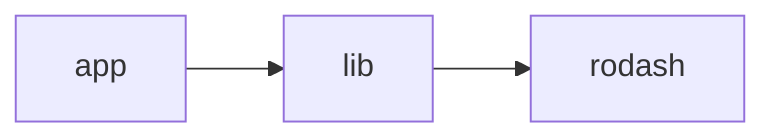

Simple demo to showcase the transitive dependencies

scenario:



usage:

```bash
pushd lib && (npm install && npm pack); popd;
pushd app && (npm install && npx ropm install && npm start); popd;
```

result:

```

.../transdeps/app/src/source/roku_modules/tkss_rodash_v0/rodash.d.bs:391:90 - error BS1001: Cannot find name 'rodash_isNotInvalid'

 391  function get(aa as object, keyPath as string, fallback = Invalid as dynamic, validator = rodash_isNotInvalid as Function) as dynamic
 ___                                                                                           ~~~~~~~~~~~~~~~~~~~                        

```
